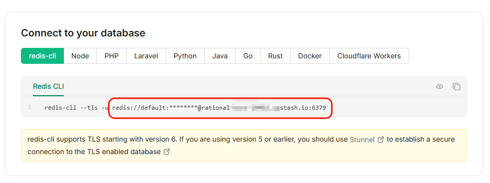
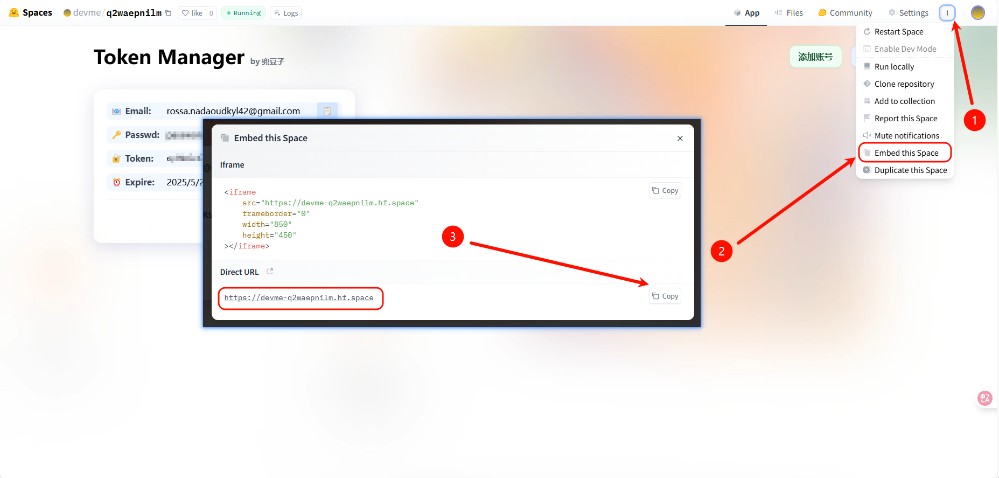

# Qwen2API 项目上下文

## 项目结构
```
├── _tmp_clone/
│   ├── README-ru.md
│   ├── README.md
│   ├── ecosystem.config.js
│   ├── package.json
│   ├── docker/
│   │   ├── Dockerfile
│   │   ├── docker-compose-redis.yml
│   │   ├── docker-compose.yml
│   ├── docs/
│   │   ├── images/
│   │   │   ├── hf.png
│   │   │   ├── upstash.png
│   ├── public/
│   │   ├── index.html
│   │   ├── package.json
│   │   ├── postcss.config.js
│   │   ├── tailwind.config.js
│   │   ├── vite.config.js
│   │   ├── public/
│   │   │   ├── favicon.png
│   │   ├── src/
│   │   │   ├── App.vue
│   │   │   ├── main.js
│   │   │   ├── style.css
│   │   │   ├── locales/
│   │   │   │   ├── ru.json
│   │   │   │   ├── zh.json
│   │   │   ├── views/
│   │   │   │   ├── auth.vue
│   │   │   │   ├── dashboard.vue
│   │   │   │   ├── settings.vue
│   │   │   ├── assets/
│   │   │   │   ├── background.mp4
│   │   │   ├── routes/
│   │   │   │   ├── index.js
│   ├── scripts/
│   │   ├── fingerprint-injector.js
│   ├── data/
│   │   ├── data_template.json
│   ├── src/
│   │   ├── server.js
│   │   ├── start.js
│   │   ├── config/
│   │   │   ├── index.js
│   │   ├── middlewares/
│   │   │   ├── authorization.js
│   │   │   ├── chat-middleware.js
│   │   ├── utils/
│   │   │   ├── account-rotator.js
│   │   │   ├── account.js
│   │   │   ├── chat-helpers.js
│   │   │   ├── cli.manager.js
│   │   │   ├── cookie-generator.js
│   │   │   ├── data-persistence.js
│   │   │   ├── fingerprint.js
│   │   │   ├── img-caches.js
│   │   │   ├── logger.js
│   │   │   ├── precise-tokenizer.js
│   │   │   ├── proxy-helper.js
│   │   │   ├── redis.js
│   │   │   ├── request.js
│   │   │   ├── setting.js
│   │   │   ├── ssxmod-manager.js
│   │   │   ├── token-manager.js
│   │   │   ├── tools.js
│   │   │   ├── upload.js
│   │   ├── models/
│   │   │   ├── models-map.js
│   │   ├── controllers/
│   │   │   ├── chat.image.video.js
│   │   │   ├── chat.js
│   │   │   ├── cli.chat.js
│   │   │   ├── models.js
│   │   ├── routes/
│   │   │   ├── accounts.js
│   │   │   ├── chat.js
│   │   │   ├── cli.chat.js
│   │   │   ├── models.js
│   │   │   ├── settings.js
│   │   │   ├── verify.js
```


## 关键文档


### README.md
<div align="center">

> [🇷🇺 Русская версия / Russian version](README-ru.md)

# 🚀 Qwen-Proxy

[](https://github.com/Rfym21/Qwen2API)
[](https://nodejs.org/)
[](https://hub.docker.com/r/rfym21/qwen2api)

[🔗 加入交流群](https://t.me/nodejs_project) | [📖 文档](#api-文档) | [🐳 Docker 部署](#docker-部署)

</div>

## 🛠️ 快速开始

### 项目说明

Qwen-Proxy 是一个将 `https://chat.qwen.ai` 和 `Qwen Code / Qwen Cli` 转换为 OpenAI 兼容 API 的代理服务。通过本项目，您只需要一个账户，即可以使用任何支持 OpenAI API 的客户端（如 ChatGPT-Next-Web、LobeChat 等）来调用 `https://chat.qwen.ai` 和 `Qwen Code / Qwen Cli`的各种模型。其中 `/cli` 端点下的模型由 `Qwen Code / Qwen Cli` 提供，支持256k上下文，原生 tools 参数支持

**主要特性：**
- 兼容 OpenAI API 格式，无缝对接各类客户端
- 支持多账户轮询，提高可用性
- 支持流式/非流式响应
- 支持多模态（图片识别、视频理解、图片/视频生成）
- 支持 OpenAI 风格资源端点：`/v1/images/generations`、`/v1/images/edits`、`/v1/videos`
- 支持智能搜索、深度思考等高级功能
- 支持 CLI 端点，提供 256K 上下文和工具调用能力
- 提供 Web 管理界面，方便配置和监控
- 批量添加账号支持实时进度展示，可在系统设置中调整登录并发数

### ⚠️ 高并发说明

> **重要提示**: `chat.qwen.ai` 对单 IP 有限速策略，目前已知该限制与 Cookie 无关，仅与 IP 相关。

**解决方案：**

如需高并发使用，建议配合代理池实现 IP 轮换：

| 方案 | 配置方式 | 说明 |
|------|----------|------|
| **方案一** | `PROXY_URL` + [ProxyFlow](https://github.com/Rfym21/ProxyFlow) | 直接配置代理地址，所有请求通过代理池轮换 IP |
| **方案二** | `QWEN_CHAT_PROXY_URL` + [UrlProxy](https://github.com/Rfym21/UrlProxy) + [ProxyFlow](https://github.com/Rfym21/ProxyFlow) | 通过反代 + 代理池组合，实现更灵活的 IP 轮换 |

**配置示例：**

```bash
# 方案一：直接使用代理池
PROXY_URL=http://127.0.0.1:8282  # ProxyFlow 代理地址

# 方案二：反代 + 代理池组合
QWEN_CHAT_PROXY_URL=http://127.0.0.1:8000/qwen  # UrlProxy 反代地址（UrlProxy 配置 HTTP_PROXY 指向 ProxyFlow）
```

### 环境要求

- Node.js 18+ (源码部署时需要)
- Docker (可选)
- Redis (可选，用于数据持久化)

### ⚙️ 环境配置

创建 `.env` 文件并配置以下参数：

```bash
# 🌐 服务配置
LISTEN_ADDRESS=localhost       # 监听地址
SERVICE_PORT=3000             # 服务端口

# 🔐 安全配置
API_KEY=sk-123456,sk-456789   # API 密钥 (必填，支持多密钥)
ACCOUNTS=                     # 账户配置 (格式: user1:pass1,user2:pass2)

# 🚀 PM2 多进程配置
PM2_INSTANCES=1               # PM2进程数量 (1/数字/max)
PM2_MAX_MEMORY=1G             # PM2内存限制 (100M/1G/2G等)
                              # 注意: PM2集群模式下所有进程共用同一个端口

# 🔍 功能配置
SEARCH_INFO_MODE=table        # 搜索信息展示模式 (table/text)
OUTPUT_THINK=true             # 是否输出思考过程 (true/false)
SIMPLE_MODEL_MAP=false        # 简化模型映射 (true/false)

# 🌐 代理与反代配置
QWEN_CHAT_PROXY_URL=          # 自定义 Chat API 反代URL (默认: https://chat.qwen.ai)
QWEN_CLI_PROXY_URL=           # 自定义 CLI API 反代URL (默认: https://portal.qwen.ai)
PROXY_URL=                    # HTTP/HTTPS/SOCKS5 代理地址 (例如: http://127.0.0.1:7890)

# 🗄️ 数据存储
DATA_SAVE_MODE=none           # 数据保存模式 (none/file/redis)
REDIS_URL=                    # Redis 连接地址 (可选，使用TLS时为rediss://)
BATCH_LOGIN_CONCURRENCY=5     # 批量添加账号时的登录并发数

# 📸 缓存配置
CACHE_MODE=default            # 图片缓存模式 (default/file)
```

#### 📋 配置说明

| 参数 | 说明 | 示例 |
|------|------|------|
| `LISTEN_ADDRESS` | 服务监听地址 | `localhost` 或 `0.0.0.0` |
| `SERVICE_PORT` | 服务运行端口 | `3000` |
| `API_KEY` | API 访问密钥，支持多密钥配置。第一个为管理员密钥（可访问前端管理页面），其他为普通密钥（仅可调用API）。多个密钥用逗号分隔 | `sk-admin123,sk-user456,sk-user789` |
| `PM2_INSTANCES` | PM2进程数量 | `1`/`4`/`max` |
| `PM2_MAX_MEMORY` | PM2内存限制 | `100M`/`1G`/`2G` |
| `SEARCH_INFO_MODE` | 搜索结果展示格式 | `table` 或 `text` |
| `OUTPUT_THINK` | 是否显示 AI 思考过程 | `true` 或 `false` |
| `SIMPLE_MODEL_MAP` | 简化模型映射，只返回基础模型不包含变体 | `true` 或 `false` |
| `QWEN_CHAT_PROXY_URL` | 自定义 Chat API 反代地址 | `https://your-proxy.com` |
| `QWEN_CLI_PROXY_URL` | 自定义 CLI API 反代地址 | `https://your-cli-proxy.com` |
| `PROXY_URL` | 出站请求代理地址，支持 HTTP/HTTPS/SOCKS5 | `http://127.0.0.1:7890` |
| `DATA_SAVE_MODE` | 数据持久化方式 | `none`/`file`/`redis` |
| `REDIS_URL` | Redis 数据库连接地址，使用TLS加密时需使用 `rediss://` 协议 | `redis://localhost:6379` 或 `rediss://xxx.upstash.io` |
| `BATCH_LOGIN_CONCURRENCY` | 批量添加账号时的登录并发数，可在前端系统设置中动态调整 | `5` |
| `CACHE_MODE` | 图片缓存存储方式 | `default`/`file` |
| `LOG_LEVEL` | 日志级别 | `DEBUG`/`INFO`/`WARN`/`ERROR` |
| `ENABLE_FILE_LOG` | 是否启用文件日志 | `true` 或 `false` |
| `LOG_DIR` | 日志文件目录 | `./logs` |
| `MAX_LOG_FILE_SIZE` | 最大日志文件大小(MB) | `10` |
| `MAX_LOG_FILES` | 保留的日志文件数量 | `5` |

> 💡 **提示**: 可以在 [Upstash](https://upstash.com/) 免费创建 Redis 实例，使用 TLS 协议时地址格式为 `rediss://...`
<div>

</div>

#### 🔑 多API_KEY配置说明

`API_KEY` 环境变量支持配置多个API密钥，用于实现不同权限级别的访问控制：

**配置格式:**
```bash
# 单个密钥（管理员权限）
API_KEY=sk-admin123

# 多个密钥（第一个为管理员，其他为普通用户）
API_KEY=sk-admin123,sk-user456,sk-user789
```

**权限说明:**

| 密钥类型 | 权限范围 | 功能描述 |
|----------|----------|----------|
| **管理员密钥** | 完整权限 | • 访问前端管理页面<br>• 修改系统设置<br>• 调用所有API接口<br>• 添加/删除普通密钥 |
| **普通密钥** | API调用权限 | • 仅可调用API接口<br>• 无法访问前端管理页面<br>• 无法修改系统设置 |

**使用场景:**
- **团队协作**: 为不同团队成员分配不同权限的API密钥
- **应用集成**: 为第三方应用提供受限的API访问权限
- **安全隔离**: 将管理权限与普通使用权限分离

**注意事项:**
- 第一个API_KEY自动成为管理员密钥，拥有最高权限
- 管理员可以通过前端页面动态添加或删除普通密钥
- 所有密钥都可以正常调用API接口，权限差异仅体现在管理功能上

#### 📸 CACHE_MODE 缓存模式说明

`CACHE_MODE` 环境变量控制图片缓存的存储方式，用于优化图片上传和处理性能：

| 模式 | 说明 | 适用场景 |
|------|------|----------|
| `default` | 内存缓存模式 (默认) | 单进程部署，重启后缓存丢失 |
| `file` | 文件缓存模式 | 多进程部署，缓存持久化到 `./caches/` 目录 |

**推荐配置:**
- **单进程部署**: 使用 `CACHE_MODE=default`，性能最佳
- **多进程/集群部署**: 使用 `CACHE_MODE=file`，确保进程间缓存共享
- **Docker 部署**: 建议使用 `CACHE_MODE=file` 并挂载 `./caches` 目录

**文件缓存目录结构:**
```
caches/
├── [signature1].txt    # 缓存文件，包含图片URL
├── [signature2].txt
└── ...
```

---

## 🚀 部署方式

### 🐳 Docker 部署

#### 方式一：直接运行

```bash
docker run -d \
  -p 3000:3000 \
  -e API_KEY=sk-admin123,sk-user456,sk-user789 \
  -e DATA_SAVE_MODE=none \
  -e CACHE_MODE=file \
  -e ACCOUNTS= \
  -v ./caches:/app/caches \
  --name qwen2api \
  rfym21/qwen2api:latest
```

#### 方式二：Docker Compose

```bash
# 下载配置文件
curl -o docker-compose.yml https://raw.githubusercontent.com/Rfym21/Qwen2API/refs/heads/main/docker/docker-compose.yml

# 启动服务
docker compose pull && docker compose up -d
```

### 📦 本地部署

```bash
# 克隆项目
git clone https://github.com/Rfym21/Qwen2API.git
cd Qwen2API

# 安装依赖
npm install

# 配置环境变量
cp .env.example .env
# 编辑 .env 文件

# 智能启动 (推荐 - 自动判断单进程/多进程)
npm start

# 开发模式
npm run dev
```

### 🚀 PM2 多进程部署

使用 PM2 进行生产环境多进程部署，提供更好的性能和稳定性。

**重要说明**: PM2 集群模式下，所有进程共用同一个端口，PM2 会自动进行负载均衡。

### 🤖 智能启动模式

使用 `npm start` 可以自动判断启动方式：

- 当 `PM2_INSTANCES=1` 时，使用单进程模式
- 当 `PM2_INSTANCES>1` 时，使用 Node.js 集群模式
- 自动限制进程数不超过 CPU 核心数

### ☁️ Hugging Face 部署

快速部署到 Hugging Face Spaces：

[](https://huggingface.co/spaces/devme/q2waepnilm)

<div>

</div>

---

## 📁 项目结构

```
Qwen2API/
├── README.md
├── ecosystem.config.js              # PM2配置文件
├── package.json
│
├── docker/                          # Docker配置目录
│   ├── Dockerfile
│   ├── docker-compose.yml
│   └── docker-compose-redis.yml
│
├── caches/                          # 缓存文件目录
├── data/                            # 数据文件目录
│   ├── data.json
│   └── data_template.json
├── scripts/                         # 脚本目录
│   └── fingerprint-injector.js      # 浏览器指纹注入脚本
│
├── src/                             # 后端源代码目录
│   ├── server.js                    # 主服务器文件
│   ├── start.js                     # 智能启动脚本 (自动判断单进程/多进程)
│   ├── config/
│   │   └── index.js                 # 配置文件
│   ├── controllers/                 # 控制器目录
│   │   ├── chat.js                  # 聊天控制器
│   │   ├── chat.image.video.js      # 图片/视频生成控制器
│   │   ├── cli.chat.js              # CLI聊天控制器
│   │   └── models.js                # 模型控制器
│   ├── middlewares/                 # 中间件目录
│   │   ├── authorization.js         # 授权中间件
│   │   └── chat-middleware.js       # 聊天中间件
│   ├── models/                      # 模型目录
│   │   └── models-map.js            # 模型映射配置
│   ├── routes/                      # 路由目录
│   │   ├── accounts.js              # 账户路由
│   │   ├── chat.js                  # 聊天路由
│   │   ├── cli.chat.js              # CLI聊天路由
│   │   ├── models.js                # 模型路由
│   │   ├── settings.js              # 设置路由
│   │   └── verify.js                # 验证路由
│   └── utils/                       # 工具函数目录
│       ├── account-rotator.js       # 账户轮询器


... (文件截断，仅显示前 200 行)

### package.json
{
  "name": "qwen2api",
  "version": "2026.04.14.09.30",
  "main": "src/server.js",
  "scripts": {
    "start": "node src/start.js",
    "dev": "nodemon src/server.js",
    "pm2": "pm2 start ecosystem.config.js",
    "pm2:stop": "pm2 stop qwen2api",
    "pm2:restart": "pm2 restart qwen2api",
    "pm2:reload": "pm2 reload qwen2api",
    "pm2:delete": "pm2 delete qwen2api",
    "pm2:logs": "pm2 logs qwen2api",
    "pm2:status": "pm2 status",
    "pm2:monit": "pm2 monit"
  },
  "keywords": [],
  "author": "",
  "license": "ISC",
  "description": "",
  "dependencies": {
    "ali-oss": "^6.22.0",
    "axios": "^1.11.0",
    "body-parser": "^1.20.3",
    "cors": "^2.8.5",
    "dotenv": "^16.4.7",
    "express": "^4.21.2",
    "form-data": "^4.0.2",
    "https-proxy-agent": "^7.0.6",
    "ioredis": "^5.6.1",
    "jwt-decode": "^4.0.0",
    "mime-types": "^3.0.1",
    "multer": "^1.4.5-lts.1",
    "pm2": "^6.0.8",
    "tiktoken": "^1.0.21"
  },
  "devDependencies": {
    "nodemon": "^3.1.7"
  }
}


## 核心代码


### src/start.js
```javascript
const cluster = require('cluster')
const os = require('os')
const { logger } = require('./utils/logger')

// 加载环境变量
require('dotenv').config()

// 获取CPU核心数
const cpuCores = os.cpus().length

// 获取环境变量配置
const PM2_INSTANCES = process.env.PM2_INSTANCES || '1'
const SERVICE_PORT = process.env.SERVICE_PORT || 3000
const NODE_ENV = process.env.NODE_ENV || 'production'

// 解析进程数
let instances
if (PM2_INSTANCES === 'max') {
  instances = cpuCores
} else if (!isNaN(PM2_INSTANCES)) {
  instances = parseInt(PM2_INSTANCES)
} else {
  instances = 1
}

// 限制进程数不能超过CPU核心数
if (instances > cpuCores) {
  logger.warn(`配置的进程数(${instances})超过CPU核心数(${cpuCores})，自动调整为${cpuCores}`, 'AUTO')
  instances = cpuCores
}

logger.info('🚀 Qwen2API 智能启动', 'AUTO')
logger.info(`CPU核心数: ${cpuCores}`, 'AUTO')
logger.info(`配置的进程数: ${PM2_INSTANCES}`, 'AUTO')
logger.info(`实际启动进程数: ${instances}`, 'AUTO')
logger.info(`服务端口: ${SERVICE_PORT}`, 'AUTO')

// 智能判断启动方式
if (instances === 1) {
  logger.info('📦 使用单进程模式启动', 'AUTO')
  // 直接启动服务器
  require('./server.js')
} else {
  // 检查是否通过PM2启动
  if (process.env.PM2_USAGE || process.env.pm_id !== undefined) {
    logger.info(`PM2进程启动 - 进程ID: ${process.pid}, 工作进程ID: ${process.env.pm_id || 'unknown'}`, 'PM2')
    require('./server.js')
  } else if (cluster.isMaster) {
    logger.info(`🔥 使用Node.js集群模式启动 (${instances}个进程)`, 'AUTO')

    logger.info(`启动主进程 - PID: ${process.pid}`, 'CLUSTER')
    logger.info(`运行环境: ${NODE_ENV}`, 'CLUSTER')

    // 创建工作进程
    for (let i = 0; i < instances; i++) {
      const worker = cluster.fork()
      logger.info(`启动工作进程 ${i + 1}/${instances} - PID: ${worker.process.pid}`, 'CLUSTER')
    }

    // 监听工作进程退出
    cluster.on('exit', (worker, code, signal) => {
      logger.error(`工作进程 ${worker.process.pid} 已退出 - 退出码: ${code}, 信号: ${signal}`, 'CLUSTER')

      // 自动重启工作进程
      if (!worker.exitedAfterDisconnect) {
        logger.info('正在重启工作进程...', 'CLUSTER')
        const newWorker = cluster.fork()
        logger.info(`新工作进程已启动 - PID: ${newWorker.process.pid}`, 'CLUSTER')
      }
    })

    // 监听工作进程在线
    cluster.on('online', (worker) => {
      logger.info(`工作进程 ${worker.process.pid} 已上线`, 'CLUSTER')
    })

    // 监听工作进程断开连接
    cluster.on('disconnect', (worker) => {
      logger.warn(`工作进程 ${worker.process.pid} 已断开连接`, 'CLUSTER')
    })

    // 优雅关闭处理
    process.on('SIGTERM', () => {
      logger.info('收到SIGTERM信号，正在优雅关闭...', 'CLUSTER')
      cluster.disconnect(() => {
        process.exit(0)
      })
    })

    process.on('SIGINT', () => {
      logger.info('收到SIGINT信号，正在优雅关闭...', 'CLUSTER')
      cluster.disconnect(() => {
        process.exit(0)
      })
    })

  } else {
    // 工作进程逻辑
    logger.info(`工作进程启动 - PID: ${process.pid}`, 'WORKER')
    require('./server.js')

    // 工作进程优雅关闭处理
    process.on('SIGTERM', () => {
      logger.info(`工作进程 ${process.pid} 收到SIGTERM信号，正在关闭...`, 'WORKER')
      process.exit(0)
    })

    process.on('SIGINT', () => {
      logger.info(`工作进程 ${process.pid} 收到SIGINT信号，正在关闭...`, 'WORKER')
      process.exit(0)
    })
  }
}

```

### src/server.js
```javascript
const express = require('express')
const bodyParser = require('body-parser')
const config = require('./config/index.js')
const cors = require('cors')
const { logger } = require('./utils/logger')
const { initSsxmodManager } = require('./utils/ssxmod-manager')
const app = express()
const path = require('path')
const fs = require('fs')
const modelsRouter = require('./routes/models.js')
const chatRouter = require('./routes/chat.js')
const cliChatRouter = require('./routes/cli.chat.js')
const verifyRouter = require('./routes/verify.js')
const accountsRouter = require('./routes/accounts.js')
const settingsRouter = require('./routes/settings.js')

if (config.dataSaveMode === 'file') {
  if (!fs.existsSync(path.join(__dirname, '../data/data.json'))) {
    fs.writeFileSync(path.join(__dirname, '../data/data.json'), JSON.stringify({"accounts": [] }, null, 2))
  }
}

// 初始化 SSXMOD Cookie 管理器
initSsxmodManager()

app.use(bodyParser.json({ limit: '128mb' }))
app.use(bodyParser.urlencoded({ limit: '128mb', extended: true }))
app.use(cors())

// API路由
app.use(modelsRouter)
app.use(chatRouter)
app.use(cliChatRouter)
app.use(verifyRouter)
app.use('/api', accountsRouter)
app.use('/api', settingsRouter)

app.use(express.static(path.join(__dirname, '../public/dist')))

app.get('*', (req, res) => {
  res.sendFile(path.join(__dirname, '../public/dist/index.html'), (err) => {
    if (err) {
      logger.error('管理页面加载失败', 'SERVER', '', err)
      res.status(500).send('服务器内部错误')
    }
  })
})

// 处理错误中间件（必须放在所有路由之后）
app.use((err, req, res, next) => {
  logger.error('服务器内部错误', 'SERVER', '', err)
  res.status(500).send('服务器内部错误')
})


// 服务器启动信息
const serverInfo = {
  address: config.listenAddress || 'localhost',
  port: config.listenPort,
  outThink: config.outThink ? '开启' : '关闭',
  searchInfoMode: config.searchInfoMode === 'table' ? '表格' : '文本',
  dataSaveMode: config.dataSaveMode,
  logLevel: config.logLevel,
  enableFileLog: config.enableFileLog
}

if (config.listenAddress) {
  app.listen(config.listenPort, config.listenAddress, () => {
    logger.server('服务器启动成功', 'SERVER', serverInfo)
    logger.info('开源地址: https://github.com/Rfym21/Qwen2API', 'INFO')
    logger.info('电报群聊: https://t.me/nodejs_project', 'INFO')
  })
} else {
  app.listen(config.listenPort, () => {
    logger.server('服务器启动成功', 'SERVER', serverInfo)
    logger.info('开源地址: https://github.com/Rfym21/Qwen2API', 'INFO')
    logger.info('电报群聊: https://t.me/nodejs_project', 'INFO')
  })
}
```

### src/config/index.js
```javascript
const dotenv = require('dotenv')
dotenv.config()

/**
 * 解析API_KEY环境变量，支持逗号分隔的多个key
 * @returns {Object} 包含apiKeys数组和adminKey的对象
 */
const parseApiKeys = () => {
    const apiKeyEnv = process.env.API_KEY
    if (!apiKeyEnv) {
        return { apiKeys: [], adminKey: null }
    }

    const keys = apiKeyEnv.split(',').map(key => key.trim()).filter(key => key.length > 0)
    return {
        apiKeys: keys,
        adminKey: keys.length > 0 ? keys[0] : null
    }
}

const { apiKeys, adminKey } = parseApiKeys()

const config = {
    dataSaveMode: process.env.DATA_SAVE_MODE || "none",
    apiKeys: apiKeys,
    adminKey: adminKey,
    batchLoginConcurrency: Math.max(1, parseInt(process.env.BATCH_LOGIN_CONCURRENCY) || 5),
    simpleModelMap: process.env.SIMPLE_MODEL_MAP === 'true' ? true : false,
    listenAddress: process.env.LISTEN_ADDRESS || null,
    listenPort: process.env.SERVICE_PORT || 3000,
    searchInfoMode: process.env.SEARCH_INFO_MODE === 'table' ? "table" : "text",
    outThink: process.env.OUTPUT_THINK === 'true' ? true : false,
    redisURL: process.env.REDIS_URL || null,
    autoRefresh: true,
    autoRefreshInterval: 6 * 60 * 60,
    cacheMode: process.env.CACHE_MODE || "default",
    logLevel: process.env.LOG_LEVEL || "INFO",
    enableFileLog: process.env.ENABLE_FILE_LOG === 'true',
    logDir: process.env.LOG_DIR || "./logs",
    maxLogFileSize: parseInt(process.env.MAX_LOG_FILE_SIZE) || 10,
    maxLogFiles: parseInt(process.env.MAX_LOG_FILES) || 5,
    // 自定义反代URL配置
    qwenChatProxyUrl: process.env.QWEN_CHAT_PROXY_URL || "https://chat.qwen.ai",
    qwenCliProxyUrl: process.env.QWEN_CLI_PROXY_URL || "https://portal.qwen.ai",
    // 代理配置
    proxyUrl: process.env.PROXY_URL || null
}

module.exports = config

```

### src/middlewares/chat-middleware.js
```javascript
const { generateUUID } = require('../utils/tools.js')
const { isChatType, isThinkingEnabled, parserModel, parserMessages } = require('../utils/chat-helpers.js')
const { logger } = require('../utils/logger')

/**
 * 处理聊天请求体的中间件
 * 解析和转换请求参数为内部格式
 */
const processRequestBody = async (req, res, next) => {
  try {
    // 构建请求体
    const body = {
      "stream": true,
      "incremental_output": true,
      "chat_type": "t2t",
      "model": "qwen3-235b-a22b",
      "messages": [],
      "session_id": generateUUID(),
      "id": generateUUID(),
      "sub_chat_type": "t2t",
      "chat_mode": "normal"
    }

    // 获取请求体原始数据
    let {
      messages,            // 消息历史
      model,               // 模型
      stream,              // 流式输出
      enable_thinking,     // 是否启用思考
      thinking_budget,      // 思考预算
      size                  //图片尺寸
    } = req.body

    // 处理 stream 参数
    if (stream === true || stream === 'true') {
      body.stream = true
    } else {
      body.stream = false
    }
    
    // 处理 chat_type 参数 : 聊天类型
    body.chat_type = isChatType(model)

    req.enable_web_search = body.chat_type === 'search' ? true : false
    
    // 处理 model 参数 : 模型
    body.model = await parserModel(model)
    
    // 处理 messages 参数 : 消息历史
    body.messages = await parserMessages(messages, isThinkingEnabled(model, enable_thinking, thinking_budget), body.chat_type)
    
    // 处理 enable_thinking 参数 : 是否启用思考
    req.enable_thinking = isThinkingEnabled(model, enable_thinking, thinking_budget).thinking_enabled
    
    // 处理 sub_chat_type 参数 : 子聊天类型
    body.sub_chat_type = body.chat_type

    // 处理图片尺寸
    if (size) {
      body.size = size
    }

    // 处理请求体,将body赋值给req.body
    req.body = body

    next()
  } catch (e) {
    logger.error('处理请求体时发生错误', 'MIDDLEWARE', '', e)
    res.status(500)
      .json({
        status: 500,
        message: "在处理请求体时发生错误 ~ ~ ~"
      })
  }
}

module.exports = {
  processRequestBody
}

```

### src/middlewares/authorization.js
```javascript
const config = require('../config')

/**
 * 验证API Key是否有效
 * @param {string} providedKey - 提供的API Key
 * @returns {Object} 验证结果 { isValid: boolean, isAdmin: boolean }
 */
const validateApiKey = (providedKey) => {
  if (!providedKey) {
    return { isValid: false, isAdmin: false }
  }

  // 移除Bearer前缀
  const cleanKey = providedKey.startsWith('Bearer ') ? providedKey.slice(7) : providedKey

  // 检查是否在有效的API keys列表中
  const isValid = config.apiKeys.includes(cleanKey)
  const isAdmin = cleanKey === config.adminKey

  return { isValid, isAdmin }
}

/**
 * API Key验证中间件 - 验证任何有效的API Key
 */
const apiKeyVerify = (req, res, next) => {
  const apiKey = req.headers['authorization'] || req.headers['Authorization'] || req.headers['x-api-key']
  const { isValid, isAdmin } = validateApiKey(apiKey)

  if (!isValid) {
    return res.status(401).json({ error: 'Unauthorized' })
  }

  // 将权限信息附加到请求对象
  req.isAdmin = isAdmin
  req.apiKey = apiKey
  next()
}

/**
 * 管理员权限验证中间件 - 只允许管理员API Key
 */
const adminKeyVerify = (req, res, next) => {
  const apiKey = req.headers['authorization'] || req.headers['Authorization'] || req.headers['x-api-key']
  const { isValid, isAdmin } = validateApiKey(apiKey)

  if (!isValid || !isAdmin) {
    return res.status(403).json({ error: 'Admin access required' })
  }

  req.isAdmin = isAdmin
  req.apiKey = apiKey
  next()
}

module.exports = {
  apiKeyVerify,
  adminKeyVerify,
  validateApiKey
}


```

### src/utils/tools.js
```javascript
const crypto = require('crypto')
const { jwtDecode } = require('jwt-decode')
const { logger } = require('./logger')


const isJson = (str) => {
  try {
    JSON.parse(str)
    return true
  } catch (error) {
    return false
  }
}

const sleep = async (ms) => {
  return await new Promise(resolve => setTimeout(resolve, ms))
}

const sha256Encrypt = (text) => {
  if (typeof text !== 'string') {
    logger.error('输入必须是字符串类型', 'TOOLS')
    throw new Error('输入必须是字符串类型')
  }
  const hash = crypto.createHash('sha256')
  hash.update(text, 'utf-8')
  return hash.digest('hex')
}

const JwtDecode = (token) => {
  try {
    const decoded = jwtDecode(token, { complete: true })
    return decoded
  } catch (error) {
    logger.error('解析JWT失败', 'JWT', '', error)
    return null
  }
}

/**
 * 生成UUID v4
 * 使用Node.js内置的crypto.randomUUID()
 * @returns {string} UUID v4字符串
 */
const generateUUID = () => {
  return crypto.randomUUID()
}

module.exports = {
  isJson,
  sleep,
  sha256Encrypt,
  JwtDecode,
  generateUUID
}

```

### src/utils/fingerprint.js
```javascript
/**
 * Ohh
 * (f ssxmod_itna Cookie @pn
 */

// ؤ!Apple M4 Mac	
const DEFAULT_TEMPLATE = {
    deviceId: '84985177a19a010dea49',
    sdkVersion: 'websdk-2.3.15d',
    initTimestamp: '1765348410850',
    field3: '91',
    field4: '1|15',
    language: 'zh-CN',
    timezoneOffset: '-480',
    colorDepth: '16705151|12791',
    screenInfo: '1470|956|283|797|158|0|1470|956|1470|798|0|0',
    field9: '5',
    platform: 'MacIntel',
    field11: '10',
    webglRenderer: 'ANGLE (Apple, ANGLE Metal Renderer: Apple M4, Unspecified Version)|Google Inc. (Apple)',
    field13: '30|30',
    field14: '0',
    field15: '28',
    pluginCount: '5',
    vendor: 'Google Inc.',
    field29: '8',
    touchInfo: '-1|0|0|0|0',
    field32: '11',
    field35: '0',
    mode: 'P'
};

// OUMn
const SCREEN_PRESETS = {
    '1920x1080': '1920|1080|283|1080|158|0|1920|1080|1920|922|0|0',
    '2560x1440': '2560|1440|283|1440|158|0|2560|1440|2560|1282|0|0',
    '1470x956': '1470|956|283|797|158|0|1470|956|1470|798|0|0',
    '1440x900': '1440|900|283|900|158|0|1440|900|1440|742|0|0',
    '1536x864': '1536|864|283|864|158|0|1536|864|1536|706|0|0'
};

// s
const PLATFORM_PRESETS = {
    macIntel: {
        platform: 'MacIntel',
        webglRenderer: 'ANGLE (Apple, ANGLE Metal Renderer: Apple M4, Unspecified Version)|Google Inc. (Apple)',
        vendor: 'Google Inc.'
    },
    macM1: {
        platform: 'MacIntel',
        webglRenderer: 'ANGLE (Apple, ANGLE Metal Renderer: Apple M1, Unspecified Version)|Google Inc. (Apple)',
        vendor: 'Google Inc.'
    },
    win64: {
        platform: 'Win32',
        webglRenderer: 'ANGLE (NVIDIA, NVIDIA GeForce RTX 3080 Direct3D11 vs_5_0 ps_5_0, D3D11)|Google Inc. (NVIDIA)',
        vendor: 'Google Inc.'
    },
    linux: {
        platform: 'Linux x86_64',
        webglRenderer: 'ANGLE (Intel, Mesa Intel(R) UHD Graphics 630, OpenGL 4.6)|Google Inc. (Intel)',
        vendor: 'Google Inc.'
    }
};

// 
const LANGUAGE_PRESETS = {
    'zh-CN': { language: 'zh-CN', timezoneOffset: '-480' },
    'zh-TW': { language: 'zh-TW', timezoneOffset: '-480' },
    'en-US': { language: 'en-US', timezoneOffset: '480' },
    'ja-JP': { language: 'ja-JP', timezoneOffset: '-540' },
    'ko-KR': { language: 'ko-KR', timezoneOffset: '-540' }
};

/**
 * :ID
 * @returns {string} 20MAm6W&2
 */
function generateDeviceId() {
    return Array.from({ length: 20 }, () =>
        Math.floor(Math.random() * 16).toString(16)
    ).join('');
}

/**
 * :<
 * @returns {number} 32M&tp
 */
function generateHash() {
    return Math.floor(Math.random() * 4294967296);
}

/**
 * pn
 * @param {Object} options - Mn	y
 * @param {string} [options.deviceId] - ID
 :
 * @param {string} [options.platform] - s: 'macIntel' | 'macM1' | 'win64' | 'linux'
 * @param {string} [options.screen] - OU: '1920x1080' | '2560x1440' | '1470x956' | '1440x900' | '1536x864'
 * @param {string} [options.locale] - : 'zh-CN' | 'zh-TW' | 'en-US' | 'ja-JP' | 'ko-KR'
 * @param {Object} [options.custom] - IW
 * @returns {string} pnW&2
 */
function generateFingerprint(options = {}) {
    const config = { ...DEFAULT_TEMPLATE };

    // (s
    if (options.platform && PLATFORM_PRESETS[options.platform]) {
        Object.assign(config, PLATFORM_PRESETS[options.platform]);
    }

    // (OU
    if (options.screen && SCREEN_PRESETS[options.screen]) {
        config.screenInfo = SCREEN_PRESETS[options.screen];
    }

    // (
    if (options.locale && LANGUAGE_PRESETS[options.locale]) {
        Object.assign(config, LANGUAGE_PRESETS[options.locale]);
    }

    // (IMn
    if (options.custom) {
        Object.assign(config, options.custom);
    }

    // ID
    const deviceId = options.deviceId || generateDeviceId();

    // SM3
    const currentTimestamp = Date.now();

    // :W
    const pluginHash = generateHash();
    const canvasHash = generateHash();
    const uaHash1 = generateHash();
    const uaHash2 = generateHash();
    const urlHash = generateHash();
    const docHash = Math.floor(Math.random() * 91) + 10;

    // 37*W
    const fields = [
        deviceId,                                   // 0: ID
        config.sdkVersion,                          // 1: SDKH,
        config.initTimestamp,                       // 2: 3
        config.field3,                              // 3: *
        config.field4,                              // 4: *
        config.language,                            // 5: 
        config.timezoneOffset,                      // 6: :O
        config.colorDepth,                          // 7: r


... (文件截断，仅显示前 200 行)
```

### src/utils/setting.js
```javascript
const accountManager = require('./account')
const { logger } = require('./logger')

/**
 * 账户设置工具
 * 提供账户的保存和删除功能，使用统一的账户管理器
 */

/**
 * 保存账户信息
 * @param {string} email - 邮箱地址
 * @param {string} password - 密码
 * @param {string} token - 访问令牌
 * @param {number} expires - 过期时间戳
 * @returns {Promise<boolean>} 保存是否成功
 */
const saveAccounts = async (email, password, token, expires) => {
  try {
    // 参数验证
    if (!email || !password) {
      logger.error('保存账户失败: 邮箱和密码不能为空', 'SETTING')
      return false
    }

    // 使用账户管理器的统一方法
    const success = await accountManager.addAccount(email, password)

    if (success) {
      logger.success(`账户 ${email} 保存成功`, 'SETTING')
      return true
    } else {
      logger.error(`账户 ${email} 保存失败`, 'SETTING')
      return false
    }
  } catch (error) {
    logger.error(`保存账户 ${email} 时发生错误`, 'SETTING', '', error)
    return false
  }
}

/**
 * 删除账户
 * @param {string} email - 邮箱地址
 * @returns {Promise<boolean>} 删除是否成功
 */
const deleteAccount = async (email) => {
  try {
    // 参数验证
    if (!email) {
      logger.error('删除账户失败: 邮箱不能为空', 'SETTING')
      return false
    }

    // 使用账户管理器的统一方法
    const success = await accountManager.removeAccount(email)

    if (success) {
      logger.success(`账户 ${email} 删除成功`, 'SETTING')
      return true
    } else {
      logger.error(`账户 ${email} 删除失败`, 'SETTING')
      return false
    }
  } catch (error) {
    logger.error(`删除账户 ${email} 时发生错误`, 'SETTING', '', error)
    return false
  }
}

/**
 * 获取所有账户信息
 * @returns {Array} 账户列表
 */
const getAllAccounts = () => {
  try {
    return accountManager.getAllAccountKeys()
  } catch (error) {
    logger.error('获取账户列表时发生错误', 'SETTING', '', error)
    return []
  }
}

/**
 * 获取账户健康状态
 * @returns {Object} 健康状态统计
 */
const getAccountHealth = () => {
  try {
    return accountManager.getHealthStats()
  } catch (error) {
    logger.error('获取账户健康状态时发生错误', 'SETTING', '', error)
    return {
      accounts: { total: 0, valid: 0, expired: 0, expiringSoon: 0, invalid: 0 },
      rotation: { total: 0, available: 0, inCooldown: 0 },
      initialized: false
    }
  }
}

/**
 * 手动刷新账户令牌
 * @param {string} email - 邮箱地址
 * @returns {Promise<boolean>} 刷新是否成功
 */
const refreshAccountToken = async (email) => {
  try {
    if (!email) {
      logger.error('刷新令牌失败: 邮箱不能为空', 'SETTING')
      return false
    }

    const success = await accountManager.refreshAccountToken(email)

    if (success) {
      logger.success(`账户 ${email} 令牌刷新成功`, 'SETTING')
      return true
    } else {
      logger.error(`账户 ${email} 令牌刷新失败`, 'SETTING')
      return false
    }
  } catch (error) {
    logger.error(`刷新账户 ${email} 令牌时发生错误`, 'SETTING', '', error)
    return false
  }
}

module.exports = {
  saveAccounts,
  deleteAccount,
  getAllAccounts,
  getAccountHealth,
  refreshAccountToken
}
```

### src/utils/logger.js
```javascript
const fs = require('fs')
const path = require('path')

/**
 * 日志管理器
 * 统一管理项目中的日志输出，支持分级打印、时间戳、Emoji标签等功能
 */
class Logger {
  constructor(options = {}) {
    this.options = {
      // 日志级别: DEBUG < INFO < WARN < ERROR
      level: options.level || 'INFO',
      // 是否启用文件日志
      enableFileLog: options.enableFileLog || false,
      // 日志文件路径
      logDir: options.logDir || path.join(__dirname, '../../logs'),
      // 日志文件名格式
      logFileName: options.logFileName || 'app.log',
      // 是否显示时间戳
      showTimestamp: options.showTimestamp !== false,
      // 是否显示日志级别
      showLevel: options.showLevel !== false,
      // 是否显示模块名
      showModule: options.showModule !== false,
      // 时间格式
      timeFormat: options.timeFormat || 'YYYY-MM-DD HH:mm:ss',
      // 最大日志文件大小 (MB)
      maxFileSize: options.maxFileSize || 10,
      // 保留的日志文件数量
      maxFiles: options.maxFiles || 5
    }

    // 日志级别映射
    this.levels = {
      DEBUG: 0,
      INFO: 1,
      WARN: 2,
      ERROR: 3
    }

    // Emoji 标签映射
    this.emojis = {
      DEBUG: '🔍',
      INFO: '📝',
      WARN: '⚠️',
      ERROR: '❌',
      SUCCESS: '✅',
      NETWORK: '🌐',
      DATABASE: '🗄️',
      AUTH: '🔐',
      UPLOAD: '📤',
      DOWNLOAD: '📥',
      CACHE: '💾',
      CONFIG: '⚙️',
      SERVER: '🚀',
      CLIENT: '👤',
      REDIS: '🔴',
      TOKEN: '🎫',
      SEARCH: '🔍',
      CHAT: '💬',
      MODEL: '🤖',
      FILE: '📁',
      TIME: '⏰',
      MEMORY: '🧠',
      PROCESS: '⚡'
    }

    // 颜色代码
    this.colors = {
      DEBUG: '\x1b[36m',    // 青色
      INFO: '\x1b[32m',     // 绿色
      WARN: '\x1b[33m',     // 黄色
      ERROR: '\x1b[31m',    // 红色
      RESET: '\x1b[0m',     // 重置
      BRIGHT: '\x1b[1m',    // 加粗
      DIM: '\x1b[2m'        // 暗淡
    }

    // 初始化日志目录
    if (this.options.enableFileLog) {
      this.initLogDirectory()
    }
  }

  /**
   * 初始化日志目录
   */
  initLogDirectory() {
    try {
      if (!fs.existsSync(this.options.logDir)) {
        fs.mkdirSync(this.options.logDir, { recursive: true })
      }
    } catch (error) {
      console.error('创建日志目录失败:', error.message)
    }
  }

  /**
   * 检查日志级别是否应该输出
   * @param {string} level - 日志级别
   * @returns {boolean}
   */
  shouldLog(level) {
    return this.levels[level] >= this.levels[this.options.level]
  }

  /**
   * 格式化时间戳
   * @returns {string}
   */
  formatTimestamp() {
    const now = new Date()
    const year = now.getFullYear()
    const month = String(now.getMonth() + 1).padStart(2, '0')
    const day = String(now.getDate()).padStart(2, '0')
    const hours = String(now.getHours()).padStart(2, '0')
    const minutes = String(now.getMinutes()).padStart(2, '0')
    const seconds = String(now.getSeconds()).padStart(2, '0')
    
    return `${year}-${month}-${day} ${hours}:${minutes}:${seconds}`
  }

  /**
   * 格式化日志消息
   * @param {string} level - 日志级别
   * @param {string} message - 日志消息
   * @param {string} module - 模块名
   * @param {string} emoji - Emoji标签
   * @returns {Object} 格式化后的消息对象
   */
  formatMessage(level, message, module = '', emoji = '') {
    const timestamp = this.options.showTimestamp ? this.formatTimestamp() : ''
    const levelStr = this.options.showLevel ? `[${level}]` : ''
    const moduleStr = this.options.showModule && module ? `[${module}]` : ''
    const emojiStr = emoji || this.emojis[level] || ''
    
    // 控制台输出格式（带颜色）
    const consoleMessage = [
      this.colors.DIM + timestamp + this.colors.RESET,
      this.colors[level] + levelStr + this.colors.RESET,
      this.colors.BRIGHT + moduleStr + this.colors.RESET,
      emojiStr,
      message
    ].filter(Boolean).join(' ')

    // 文件输出格式（无颜色）
    const fileMessage = [
      timestamp,
      levelStr,
      moduleStr,


... (文件截断，仅显示前 200 行)
```

### src/utils/precise-tokenizer.js
```javascript
/**
 * 精准Token统计工具
 * 使用tiktoken进行准确的token计数
 */

const tiktoken = require('tiktoken')

/**
 * 使用tiktoken进行精准token计数
 * @param {string} text - 要计数的文本
 * @param {string} model - 模型名称，默认为gpt-3.5-turbo
 * @returns {number} 精确的token数量
 */
function countTokens(text, model = 'gpt-3.5-turbo') {
  if (!text || typeof text !== 'string') return 0

  const encoding = tiktoken.encoding_for_model(model)
  const tokens = encoding.encode(text)
  encoding.free() // 释放内存
  return tokens.length
}


/**
 * 计算消息数组的token数量
 * @param {Array} messages - 消息数组
 * @param {string} model - 模型名称
 * @returns {number} 总token数量
 */
function countMessagesTokens(messages, model = 'gpt-3.5-turbo') {
  if (!Array.isArray(messages)) return 0

  let totalTokens = 0

  // 每条消息的基础开销（根据OpenAI文档）
  const messageOverhead = 4 // 每条消息约4个token的格式开销

  for (const message of messages) {
    totalTokens += messageOverhead

    // 角色token
    if (message.role) {
      totalTokens += countTokens(message.role, model)
    }

    // 内容token
    if (typeof message.content === 'string') {
      totalTokens += countTokens(message.content, model)
    } else if (Array.isArray(message.content)) {
      for (const item of message.content) {
        if (item.text) {
          totalTokens += countTokens(item.text, model)
        }
      }
    }

    // 函数调用等其他字段的token计算
    if (message.function_call) {
      totalTokens += countTokens(JSON.stringify(message.function_call), model)
    }
  }

  // 对话的额外开销
  totalTokens += 2 // 对话开始和结束的token

  return totalTokens
}

/**
 * 创建精准的usage对象
 * @param {Array|string} promptMessages - 提示消息或文本
 * @param {string} completionText - 完成文本
 * @param {object} realUsage - 真实的usage数据（如果有）
 * @param {string} model - 模型名称
 * @returns {object} usage对象
 */
function createUsageObject(promptMessages, completionText = '', realUsage = null, model = 'gpt-3.5-turbo') {
  // 如果有真实的usage数据，优先使用
  if (realUsage && realUsage.prompt_tokens && realUsage.completion_tokens) {
    return {
      prompt_tokens: realUsage.prompt_tokens,
      completion_tokens: realUsage.completion_tokens,
      total_tokens: realUsage.total_tokens || (realUsage.prompt_tokens + realUsage.completion_tokens)
    }
  }

  // 计算prompt tokens
  let promptTokens = 0
  if (Array.isArray(promptMessages)) {
    promptTokens = countMessagesTokens(promptMessages, model)
  } else if (typeof promptMessages === 'string') {
    promptTokens = countTokens(promptMessages, model)
  }

  // 计算completion tokens
  const completionTokens = countTokens(completionText, model)

  return {
    prompt_tokens: promptTokens,
    completion_tokens: completionTokens,
    total_tokens: promptTokens + completionTokens
  }
}

module.exports = {
  countTokens,
  countMessagesTokens,
  createUsageObject
}

```